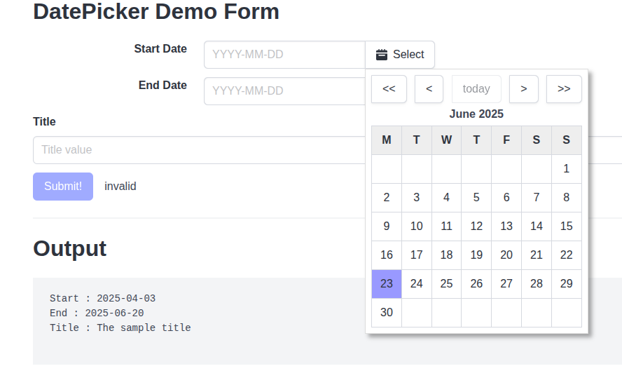

# Date Picker in elm

Simple date picker widget for input forms allowing users to select a date graphically.



## Features
- Uncoupled from model (works entirely through basic types and messages)
- Multiple pickers on one form
- Based on bulma css (could be bug?)

## Requirements

- node (v23)
- nvm (0.39.1)

## Running

```bash
cd ${project_repo_dir}
nvm use
npm install
make
elm reactor
# now open http://localhost:8000/public/index.html
```
